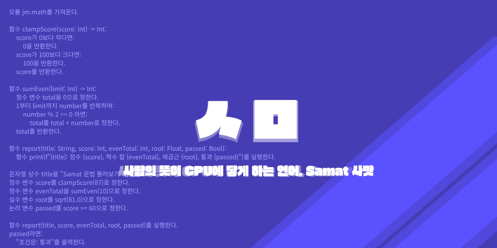

# Samat



한글날 100주년을 맞아 2026년 10월 9일, 정오(正午)에 반포하는 사맛은, 옛날 훈민정음의 창제 정신을 580년이 지난 지금, 컴퓨팅의 영역으로 이어가는 언어입니다.

옛날, 어려운 한문을 배우기 어려운 백성들을 생각하여 만들어진 훈민정음처럼, 사맛과 사맛의 한국어 언어 문법인 훈C정음(訓C正音, CPU를 가르치는 바른 소리)도 코딩을 시작하고 싶은 모든 사람들을 돕는 언어가 되었으면 합니다.

Code Syntax와 訓C正音은 하나의 AST와 실행 체계를 공유합니다.

## Samat의 두 문법

| Code Syntax | 訓C正音 |
| --- | --- |
| 익숙한 영문 키워드로 작성 | 한국어 표현으로 작성 |
| `.st` 소스 파일 | 같은 Samat AST와 실행 체계 공유 |

```samat
fn factorial(n: Int) -> Int:
    if n <= 1:
        return 1
    return n * factorial(n - 1)

fn main() -> Int:
    return factorial(5)
```

```text
함수 factorial(n: Int) -> Int:
    n이 1보다 작거나 같다면:
        1을 반환한다.
    n * factorial(n - 1)을 반환한다.
```

## 주요 특징

- `.st` 확장자로 작성하는 Samat 소스 코드
- 인터프리터와 네이티브 컴파일 백엔드
- 같은 AST와 런타임을 사용하는 Code Syntax와 訓C正音
- 해례(Haerye) `.hy` 파일의 파싱, 검증, 직렬화
- Windows용 Samat Studio: 범주별 예제 탐색, 편집, 검사, 실행
- Windows와 Linux 빌드 지원

## 빠른 시작

### Windows

```powershell
cmake -S . -B build -A x64
cmake --build build --config Release
.\build\Release\Samat.exe run .\main.st
```

Samat Studio를 실행하려면 다음을 실행하세요.

```powershell
.\build\Release\SamatStudio.exe
```

### Linux

```bash
cmake -S . -B build -DCMAKE_BUILD_TYPE=Release
cmake --build build -j
./build/Samat run main.st
```

명령줄 도움말은 `Samat --help`에서 확인할 수 있습니다.

## 예제

`examples/Samat/v1.0/`에서 언어 예제를 확인할 수 있습니다. 가장 간단한 예제는 `hello.st`입니다.

```powershell
.\build\Release\Samat.exe run .\examples\Samat\v1.0\hello.st
```

프로젝트 루트의 `main.st`에는 Samat 소개와 대화형 계산기 예제가 있습니다.

## 訓C正音 해례

해례 파일은 `.hy` 확장자를 사용하며, 장면을 선언형 문법으로 표현합니다.

```text
examples/Haerye/pong.hy
```

```text
Samat haerye validate examples/Haerye/pong.hy
Samat haerye format examples/Haerye/pong.hy
```

## 빌드 요구 사항

- CMake 3.24 이상
- C++20 지원 컴파일러
- Windows: Visual Studio 2022 또는 호환 MSVC
- Linux: GCC 또는 Clang
- LLVM 17 이상은 선택 사항이며 JIT/AOT 백엔드에 사용됩니다.

## 테스트

```powershell
ctest --test-dir build -C Release --output-on-failure
```

Linux에서는 빌드 디렉터리에서 실행합니다.

```bash
ctest --test-dir build --output-on-failure
```

## 라이선스

Samat은 [MIT License](LICENSE)로 배포합니다.

## 감사의 말

세종대왕님, 정의공주님, 문종대왕님, 집현전의 모든 학자들, 그리고 한글의 창제와 발전에 도움을 주신 모든 분들께 특별한 감사를 전합니다.

Special thanks to King Sejong, Princess Jeongui, King Munjong, all scholars from Jiphyeonjeon, and all those who contributed to Hangeul.
