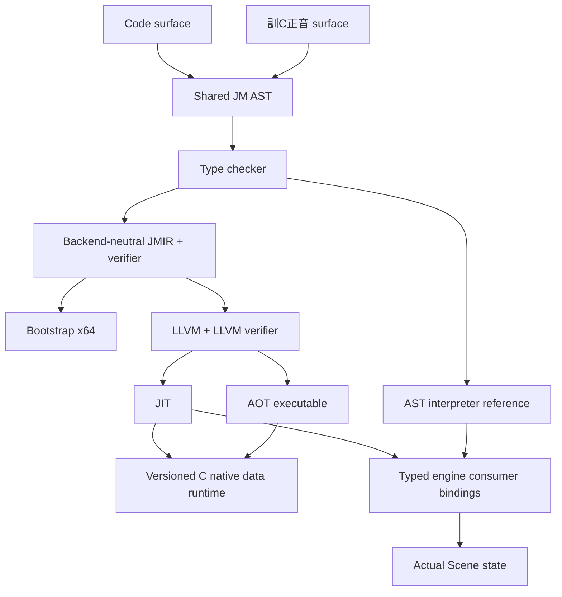

# Samat / 訓C正音 v0.6 — Native Data Model & Engine Runtime

This report distinguishes executed capabilities from the remaining roadmap. v0.6 extends native data execution through shared AST → JMIR → LLVM → the C runtime ABI; it does not claim completion of every requested language/editor feature.

## 1. v0.5+ checkpoint

Reviewed tracked changes and generated-file exclusions, reran baseline CTest (4/4) and ASan/UBSan (3/3), then committed `dd7f9c4` and pushed `HEAD:main` normally. The checkpoint followed `b302b09` without rewriting history. v0.6 changes remain a reviewable working-tree change.

## 2. Implementation summary

LLVM JIT and Linux AOT now execute concrete Struct fields, Vector2/3, Color values, heterogeneous Tuple access, stepped Range iteration and typed Map<String,T>. Real engine position/velocity/scale/rotation use typed native bindings. Existing String/List execution and independent core builds remain.

## 3. Ten largest changes

1. Native Struct construction, field reads/writes and shared aliases, including globals.
2. Native Vector2/3 arithmetic, scalar multiplication/division, math methods and value parameters/returns.
3. Native Color construction and component reads.
4. Native heterogeneous Tuple literal fields and indexing.
5. Native half-open Range with signed step, field access and foreach.
6. Native typed String-key Map operations and deterministic keys/values.
7. ABI version checks and aggregate child tracing.
8. List/Vector/Color typed callback marshaling and List element metadata.
9. Actual Scene Vector2 properties and persistent native engine updates.
10. Differential/AOT/ownership/stress tests, GUI lifecycle smoke and expanded benchmark.

## 4. Files

`RuntimeABI.h/.cpp`, `JMIR.hpp/.cpp`, `IRVerifier.cpp`, `LLVMBackend.cpp`, `LanguageCore.hpp/.cpp`, `TypeChecker.cpp`, `X64Backend.cpp`, `EngineScriptAPI.cpp`, `Scene.hpp/.cpp`, Application read-only scene accessor, Sandbox smoke controls, CLI version, `CMakeLists.txt`, `NativeDataRegression.cpp`, benchmark, paired `examples/Samat/v06` samples, and `.github/workflows/Samat-core.yml`.

## 5. Type system

Primitive tag values remain stable. Existing Type variants represent the new native models. `Map<String,Int/Float/Bool/String>` adds primitive value metadata; other key types and nested generic annotations are explicitly unsupported. Typed Map mutations and aliases enforce values, with Int→Float promotion. Struct bindings preserve known schema through lexical scopes and aliases to diagnose nonexistent fields. Full named semantic types, nullable narrowing and source columns remain unfinished.

## 6. AST

The existing shared Struct/Tuple/Range/Map/Vector AST is reused. Code and Korean annotations preserve the same Map metadata. Korean parameter splitting respects angle-bracket commas; numeric tuple member lexing supports chains such as `tuple.2.length`. No identifiers or Korean source are translated.

## 7. JMIR / verifier

Backend-neutral runtime operations encode construction, extraction, mutation, vector arithmetic and indexing. They use language types and opaque handles, not LLVM layout names. Function value-element metadata describes native Maps. The verifier checks constant layout descriptors, field payload tags, Map key/value/result types, runtime arity, cross-type vector operations, SSA dominance and existing control-flow contracts. Field existence is checked by the semantic checker/lowerer; alias-dependent record layout validation is also enforced at runtime. Full aggregate layout tables and ownership effects in IR remain future work.

## 8. Runtime ABI

`JM_RUNTIME_ABI_VERSION` is 2. `jm_runtime_abi_version` reports it and `jm_runtime_require_abi` diagnoses mismatch (JM6003). JIT checks the linked runtime; managed Linux AOT emits a version requirement. C signatures expose fixed-width integers, UTF-8 bytes and context-owned handles, with no STL or renderer types at the C boundary. AOT runtime archives must match the compiler revision.

## 9. Memory / ownership

String/List/Map/Struct/Tuple/Vector/Color/Range are context-owned native objects. Struct/Tuple field tags and Map value metadata trace managed children. String keys are copied into Map-owned bytes. Retained handles remain roots until release; module globals remain rooted; public return Values and callback arguments are snapshots copied out of the runtime. Borrowed handles/bytes are invalid after collection unless retained/rooted. Collection remains at invocation boundaries, so a long loop can retain temporary allocations until it returns. There is no moving GC or escape analysis.

## 10. Interpreter

Vector properties (`length`, `lengthSquared`, `normalized`) and scalar×vector now align with native operations. New typed Maps enforce primitive values, String keys and missing-key errors. Existing untyped Maps retain their legacy heterogeneous/null-on-missing behavior; native lowering rejects them. REPL Struct definitions are installed in persistent declaration storage. Existing Struct references, immutable tuples and half-open ranges remain.

## 11. Bootstrap x64

No dynamic data support was faked. Scalar behavior remains, and unsupported aggregate/runtime operations produce capability errors. Typed callback metadata can describe new types, but their bootstrap ABI is unsupported.

## 12. LLVM JIT

Managed data uses i64 handles and Float uses f64. Logical Vector/Color values are immutable snapshots; arithmetic creates values rather than mutating aliases. String/List/Vector2/3/Color public boundaries marshal concrete values. Public Struct/Tuple/Map/Range return decoding is explicitly rejected until layout metadata is available. Internal typed Map function parameters/returns work. Struct parameters, nested named Struct layouts, tuple function layouts and List globals remain unsupported.

## 13. LLVM AOT

Actual Linux executables validate Struct, Vector2, Map, Tuple/Range, String/List and file imports. AOT main remains a zero-argument Int/Bool/Void entry. Managed values use the sibling runtime archive and version check. Portable typed host callback linking and managed Windows runtime archives remain unsupported; generated objects alone are not execution evidence.

## 14. Typed FFI

Registry metadata supports Int/Float/Bool/String/Void and adds List, Vector2/3 and Color. Lists require concrete primitive element metadata for arguments and returns. Arguments/results are copied at the host boundary; callback mutations of copied Lists do not change script Lists. Up to four arguments are supported. Lowering checks arity, argument names/types, List elements and backend capability; dispatch checks actual returns. Named Struct/Optional handles and AOT typed host callbacks remain unsupported. Metadata is reusable by editor consumers, but an autocomplete UI was not implemented.

## 15. Modules

Existing canonical file identity, relative paths, dependency-first initialization, duplicate-once loading and cycle diagnostics are retained and tested with native Vector helpers. User modules still share a flat namespace. Namespaced exports, package resolution and module aliases were not implemented in v0.6.

## 16. Standard library

Preserves math, String/List algorithms, conversions, random/time and host IO. Adds native Map containsKey/remove/length/clear/keys/values, range construction/iteration and Vector math. `print`/`println` remain legacy newline aliases. Color static constants remain interpreter-only; Color lerp/withAlpha, interpolation, lambdas and higher-order collections are unsupported.

## 17. 訓C正音

Paired samples are produced with the actual Korean renderer, parsed directly and round-tripped against Code AST. Map annotations and function signatures preserve generic commas. Hangul identifiers execute in interpreter and LLVM; identifiers retain exact UTF-8 byte identity, with no normalization or identifier translation. NFC/NFD equivalence is not implemented. Existing particle rules remain; no NLP/guessing parser is introduced.

## 18. JM Engine integration

| API | Parameters / result | Effect / ownership | Interpreter / LLVM JIT |
|---|---|---|---|
| `player.position` | → Vector2 | Actual Scene position, copied value | Executed |
| `player.position = v` / `+= v` | Vector2 → Void | Typed `player.setPosition` bridge; finite Float32 checks | Executed |
| `player.velocity` / `setVelocity(v)` | Vector2 | Actual horizontal/vertical physics velocity | Binding implemented; full physics demo partial |
| `player.scale` / `setScale(v)` | Vector2 | Actual Scene scale | Binding implemented; end-to-end UNTESTED |
| `player.rotation` / `setRotation(v)` | Float | Actual 2D rotation in degrees | Binding implemented; end-to-end UNTESTED |
| `time.delta` | → Float | Current tick seconds | Executed |
| `input.keyHeld(0/1/2)` | Int → Int | Stable left/right/space IDs | Existing executed path |
| `player.jumpFloat(force)` | Float → Bool | Actual grounded jump | Existing executed path |

Scene physics integrates horizontalVelocity and resets it when replacing objects. Engine IDs are resolved at each call; new property access on a missing/destroyed Player raises JM7101 instead of dereferencing a pointer. Rich Entity/Optional typing, general entity properties, mouse/released input and component APIs remain future work. Korean canonical rendering uses these same expressions inside Korean statements; an API-specific natural-language vocabulary was not added.

## 19. Play / Stop / events

Engine runtime creation initializes globals; start dispatch is once-only; each tick sets input/delta, dispatches update and fixedUpdate, then held/pressed events in deterministic order. The application performs physics after the script tick. Stop releases the runtime and restores the Scene snapshot. Native runtime stress creates/destroys 50 sessions per backend with 100 updates per session. This is separate from the GUI Play/Stop smoke, which checks actual application restoration and bounded rendering. Collision callbacks, hot reload/state migration and asynchronous interruption are not implemented. Editor Play still selects interpreter; LLVM event execution is available through the engine consumer API and exercised by tests.

## 20. CLI / REPL / formatter

Version is 0.6.0. Existing check/run/build/JIT/IR/format interfaces remain compatible. REPL now supports newly declared Struct construction and persistent field access. Incremental whole-session static checking remains partial. Format/Code/Korean semantic round trips are tested; comments are not preserved. Sandbox adds `--smoke-cycles N` to repeat bounded language Play/render/Stop and verify Scene restoration.

## 21. Tests

Final results are recorded below after the final build. The new suite compares native models at O0/O2, preserves failing vector seeds/source, checks typed List callbacks, invalid data, IR Map metadata, UTF-8 identifiers, public Vector ABI, native ownership, engine events and actual AOT exits. Existing tests are retained. CI adds independent Linux core/no-LLVM and sanitizer jobs; the workflow itself has not run in GitHub Actions in this task.

## 22. Sanitizers

ASan/UBSan with leak detection exercises standalone core/runtime and a separate engine-enabled LLVM-disabled build. Runtime stress includes 1,000 rounds of traced record/List/String ownership, Map String ownership, vector math and full collection. Native engine session destruction is exercised in the engine-enabled sanitizer build. LLVM-generated code and GUI graphics drivers are not claimed to be sanitizer-instrumented. A build during a header/layout edit produced an ASan failure; final validation uses rebuilt translation units with the final layout rather than suppressing the failure.

## 23. Native executable validation

Regression tests execute four new Linux AOT programs and assert exit 42. Existing String/List success/failure executables remain. Manual paired sample runs and installed CLI AOT validate the installed archive path. Typed callback and engine callback AOT execution is not claimed.

## 24. Windows

UNTESTED for actual Windows execution. Linux COFF/scalar PE generation in the existing suite does not establish Windows runtime, aggregate ABI, callback unwinding or engine execution. Managed Windows runtime linking remains unsupported.

## 25. Backend capability matrix

PASS denotes executed evidence for the existing supported subset. PARTIAL includes the restrictions above; it does not mean all combinations work. AOT refers to Linux execution. Windows execution is UNTESTED.

| Feature | Interpreter | x64 | LLVM JIT | LLVM AOT |
|---|---|---|---|---|
| Int | PASS | PASS | PASS | PASS |
| Bool | PASS | PASS | PASS | PASS |
| Float | PASS | UNSUPPORTED | PASS | PASS |
| String | PASS | UNSUPPORTED | PASS | PASS |
| List | PARTIAL | UNSUPPORTED | PARTIAL | PARTIAL |
| Map | PARTIAL | UNSUPPORTED | PARTIAL | PARTIAL |
| Tuple | PARTIAL | UNSUPPORTED | PARTIAL | PARTIAL |
| Range | PARTIAL | PARTIAL | PARTIAL | PARTIAL |
| Enum | PARTIAL | UNSUPPORTED | UNSUPPORTED | UNSUPPORTED |
| Struct | PARTIAL | UNSUPPORTED | PARTIAL | PARTIAL |
| Optional | UNSUPPORTED | UNSUPPORTED | UNSUPPORTED | UNSUPPORTED |
| Vector2 | PARTIAL | UNSUPPORTED | PARTIAL | PARTIAL |
| Vector3 | PARTIAL | UNSUPPORTED | PARTIAL | UNTESTED |
| Color | PARTIAL | UNSUPPORTED | PARTIAL | UNTESTED |
| Globals | PARTIAL | PARTIAL | PARTIAL | PARTIAL |
| for | PASS | PASS | PASS | PASS |
| foreach | PARTIAL | UNSUPPORTED | PARTIAL | PARTIAL |
| break | PASS | PASS | PASS | PARTIAL |
| continue | PASS | PASS | PASS | PARTIAL |
| modules | PARTIAL | PARTIAL | PARTIAL | PARTIAL |
| typed FFI | PARTIAL | PARTIAL | PARTIAL | UNSUPPORTED |
| engine FFI | PARTIAL | PARTIAL | PARTIAL | UNSUPPORTED |
| events | PASS | PARTIAL | PASS | UNSUPPORTED |

## 26. Benchmarks

Seven result-checked workloads: integer, Float, Vector2, Struct fields, List iteration, Map lookup and String concatenation. Debug build, ten invocations after warmup, runtime loop bounds; compiler/JIT setup excluded. Native invocation timing includes boundary collection. O2 can simplify arithmetic loops; runtime-call aggregates are heap allocated, not SIMD/stack-optimized. Final measured values and host details appear below. No AOT performance or production speed claims are made.

## 27. Samples

`native-struct`, `native-vector`, `native-map`, `native-tuple-range`, `tokenizer` and `modules/main` each have `.st/.jmk` pairs. Native-vector simulates ten updates and validates position. Tokenizer is deliberately a whitespace-split utility returning `[let, x, =, 10]`; it does not claim a complete tokenizer or self-hosted compiler. `engine-vector-events` demonstrates shared Struct state, actual position changes, input and jump.

## 28. Unsupported / partial scope

Nested/named Struct signatures and record return marshaling; Vector component writes/static vectors; native Color constants/methods; tuple destructuring/dynamic indices/function layouts; inclusive first-class Range; native untyped/non-String-key/nested-value Maps; nested generic annotations; Optional/null narrowing; function values/lambdas/interpolation; namespaced user modules; complete diagnostic spans/autocomplete/debug information; full Entity/input/component systems; native Play UI selection; Windows managed runtime and typed AOT callbacks. These are explicitly unfinished, not replaced with fake native support.

## 29. Technical debt / self-hosting readiness

Aggregate values are heap handles and collection is only at invocation boundaries. Struct layout identity is known to lowering but not a complete named semantic type graph. Generic metadata remains a constrained built-in representation. Modules are flat; editor settings and hot-reload state are not serialized. Unicode normalization is absent. String/List/typed Map/Struct/loops are sufficient for small tokenizer utilities; named types, modules, richer IO and complete diagnostics still limit compiler-component development. No compiler rewrite was performed.

## 30. v0.7 priorities

1. Named semantic types and nested Struct layouts with stable public return marshaling.
2. Optional<Entity> and flow-sensitive safe access.
3. Nested generics and Map key/value descriptors.
4. Inline/value aggregate IR and allocation safe points after correctness tests.
5. Qualified modules and exported symbol rules.
6. Vector component assignment, Color methods and tuple function layouts.
7. Actual Windows runtime builds, ABI execution and portable typed AOT callbacks.
8. Editor native backend selection, serialized settings and cancellation/hot reload contracts.
9. Rich Entity/input/collision APIs with end-to-end tests.
10. Complete diagnostic spans, metadata-driven autocomplete and sustained fuzzing.

## Architecture



The existing interpreter consumes shared AST; native backends all lower through JMIR. Core and runtime have no engine/SDL/OpenGL dependency.

## Reproduction

```bash
source /workspace/.tools/env.sh
cmake --build build --parallel 4
ctest --test-dir build --output-on-failure
build/SamatCompiler check examples/Samat/v06/native-struct.st
build/SamatCompiler run examples/Samat/v06/native-vector.st
build/SamatCompiler --llvm-jit main examples/Samat/v06/native-map.st -O
build/SamatCompiler build examples/Samat/v06/native-tuple-range.st -o /tmp/jm-v06
/tmp/jm-v06  # expected exit 42
```

Independent core: `-DJMENGINE_BUILD_ENGINE=OFF`. No LLVM: `-DJMENGINE_ENABLE_LLVM=OFF`. Sanitizers: `-DSamat_ENABLE_SANITIZERS=ON`, with LLVM disabled in the tested sanitizer configurations. Install the `Samat` component to keep CLI and runtime archive together.

## Final validation and measurements

| Configuration | Registered CTest tests | Pass | Fail | CTest skip |
|---|---:|---:|---:|---:|
| Engine + LLVM 19 | 5 | 5 | 0 | 0 |
| Independent CLI + LLVM | 4 | 4 | 0 | 0 |
| Engine without LLVM | 5 | 5 | 0 | 0 |
| Core ASan/UBSan, no LLVM | 4 | 4 | 0 | 0 |
| Engine ASan/UBSan, no LLVM | 5 | 5 | 0 | 0 |
| Fresh independent core, no LLVM | 4 | 4 | 0 | 0 |

Baseline had four CTest suites; v0.6 adds one suite. In the default engine/LLVM configuration: existing compiler checks 119 + existing extended checks 66 + new native-data checks 61 = **246 passing check groups**. There are **10 existing explicit capability skips**, and **0 unavailable groups in the new default suite**; these counters are distinct from CTest skip status. Engine smoke and runtime-memory suites pass separately and are not folded into that 246 count. In the no-LLVM engine configuration, compiler/extended/native-data counters are 118/60/53; compiler capability skips are 44 and new-suite unavailable configuration groups are 49. Unavailable backends are detected by configuration, not by catching failed assertions and turning them into skips.

ASan/UBSan final runs use `ASAN_OPTIONS=detect_leaks=1 UBSAN_OPTIONS=halt_on_error=1`. The earlier mixed-layout sanitizer failure disappeared after rebuilding affected translation units with the final header layout. No sanitizer failure is suppressed and no test was deleted. The new malformed-IR test specifically changes the Map creation descriptor and verifies rejection.

Actual GUI: **50 Play/render/Stop cycles, 150 SDL/OpenGL/ImGui frames**, with Scene positions and velocities restored after every Stop. Runtime consumer tests additionally create/destroy 50 sessions per interpreter/LLVM backend and dispatch 100 updates per session. Ownership stress executes 1,000 collection rounds. Differential vector tests retain 32 reproducible seeds alongside the preceding 64 scalar and 32 List cases.

Six paired sample programs (`modules/main`, native-map, native-struct, native-tuple-range, native-vector, tokenizer) return 42 under Interpreter and LLVM JIT for both surfaces. Each Korean sample is also built and **executed** as Linux AOT with exit 42. Installed CLI + sibling runtime archive builds and executes Struct AOT with exit 42. Four new regression AOT programs execute successfully; preceding native String/List and error exits remain. Four aggregate LLVM dumps also pass `opt-19 -passes=verify`.

Measured Debug host: x86-64, Intel Xeon Platinum 8573C, five visible CPUs; GCC 14, LLVM 19.1.7. Ten result-checked invocations, milliseconds, while a fresh core build ran concurrently:

| Workload | Steps/elements | Interpreter | LLVM O0 | LLVM O2 |
|---|---:|---:|---:|---:|
| Integer accumulation | 10,000 | 841.970 | 0.259 | 0.048 |
| Float accumulation | 10,000 | 5019.780 | 0.355 | 0.116 |
| List construction/foreach | 1,000 | 147.776 | 1.541 | 1.450 |
| Vector2 accumulation | 1,000 | 98.839 | 10.731 | 10.242 |
| Struct field accumulation | 1,000 | 136.301 | 1.389 | 1.162 |
| Map lookup | 1,000 | 113.851 | 9.321 | 25.578 |
| String concatenation | 1,000 | 117.725 | 16.659 | 31.512 |

Bootstrap integer time was 0.295 ms; remaining workloads are outside its capability. Concurrent load and allocation/collection variance make the Map/String O2 figures slower here; they are reported as measured, not adjusted into a speedup claim. No Release, AOT timing or Windows runtime validation was performed.

`git diff --check` passes. Remote `main` is still the authorized v0.5+ checkpoint `dd7f9c4`; this v0.6 change is uncommitted. No generated binaries, build caches, local environment scripts or temporary executables are included in the source change.
