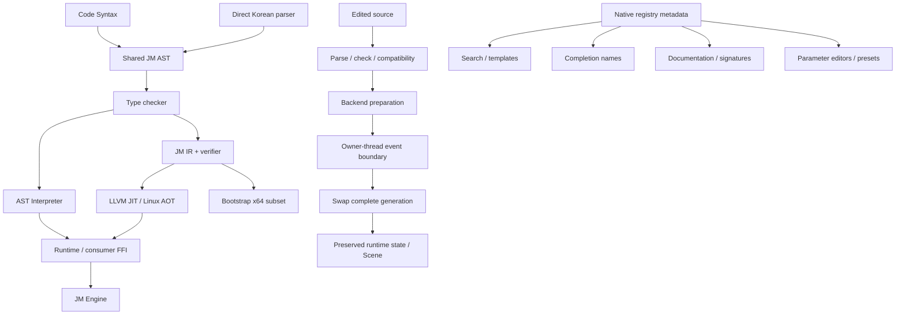

# Samat / 訓C正音 v0.7 — Safe & Live (PARTIAL milestone)

This release implements a tested first subset of Optional, safe Scene references and live program generations. It is **not the complete feature set in the v0.7 request**. Limits below are part of the supported contract, not silent fallback behavior. Existing names remain unchanged.

## 1. v0.6 checkpoint

`a761ce2a2607401f84dd59e8c999ab111d25c68d` was reviewed, rebuilt, tested (base 5/5, core ASan/UBSan 4/4, engine ASan/UBSan 5/5), committed and normally pushed to main. No force push/history rewrite.

## 2. Working tree

v0.7 follows the checkpoint and is **uncommitted** for review as a PARTIAL milestone. Local HEAD and remote main remain `a761ce2a2607401f84dd59e8c999ab111d25c68d`. No v0.7 push, force push or history rewrite was performed.

## 3. Changed modules

LanguageCore/TypeChecker/SurfaceRenderer, JMIR/IRVerifier/LLVMBackend, RuntimeABI, NativeFunctionRegistry/LanguageMetadata, EngineScriptAPI, Scene, Application/Sandbox, SafeLiveRegression, samples and this report. Language core still builds without Scene, SDL or OpenGL.

## 4. Optional status

Real `Type::Optional` plus payload metadata; `Int?`, `Float?`, `Bool?`, `String?`, `Vector2?`, `Vector3?`, `Color?`, `Entity?` and known named Struct local annotations. Primitive Optional Struct fields are supported. `null` cannot initialize a concrete non-optional scalar/Entity. Dynamic `Any` retains its existing behavior.

Nested generic annotations (`List<Entity?>`, `Map<String,Entity?>`, `List<Int>?`) and named/nested Struct fields/signatures are UNSUPPORTED. They must not be assumed from the scalar Optional subset.

## 5. Representation

Interpreter: explicit Optional box, payload Type, optional nominal Struct name/schema and empty or Value payload. LLVM JIT/AOT: context-owned opaque Optional handle with presence, payload tag and bits/child handle. Empty Int and Int zero, empty Bool and Bool false remain distinct. JM IR retains semantic payload metadata; it does not contain LLVM struct layouts. Bootstrap x64 rejects Optional.

## 6. Narrowing

Identifier `!= null` true branch, `== null` false branch and `if x == null: return` continuation. The checker keeps conservative branch bindings. Assigning null within a narrowed branch is rejected. Arbitrary control-flow proofs and `&&`-dependent narrowing are UNSUPPORTED. Runtime unwrap remains checked.

`??` evaluates the fallback only when empty. `?.` supports selected value properties (String length, vector components/length, known Struct fields, Entity position/id) and the Void `Entity?.destroy()` call. General optional chaining with arguments, arbitrary chains and optional-returning member flattening are not a complete feature. Void chaining skips both the call and argument evaluation when empty.

## 7. Entity safety model

`scene.find(String) -> Entity?`. Value stores object ID, Scene identity and object generation, never a Scene/GameObject pointer. Scene creation uses monotonic tokens; Scene replacement and copies receive a new identity. Every Entity API resolves by identity + ID + generation before access.

The earlier String-returning lookup is available as `scene.findId`; String `scene.createSprite`/`scene.destroy` APIs remain compatibility operations. The v0.6 scene regression uses findId and retains its Scene assertions.

## 8. Stale handles

Destroyed/reset/other-Scene references throw `JM7102`. An Optional containing a destroyed Entity remains **present but stale**; it does not silently become empty. `!= null` checks presence, not liveness. Object ID reuse through Scene creation does not resurrect old references. Host code must preserve Scene's identity/generation invariants when using its mutable object vector.

## 9. Live architecture



Interpreter remains an AST executor; it is not incorrectly described as executing JM IR. LLVM prepares and verifies a complete replacement module, transfers supported values, then changes the stable EngineEventRuntime dispatch object's generation. Existing frames cannot be executing during replacement. Internal calls in each generation use that generation's implementations; no live instruction patching or freeing active JIT code.

## 10. What can swap

Compatible function bodies; event handler sets (replace, not accumulate); changed literal primitive globals; compatible additions/removals of literal globals in the supported backend subset. Globals whose declaration/initializer remains identical preserve the current value. No start event is replayed.

Interpreter prepares a copied binding table. LLVM uses generated typed global accessors in isolated candidate storage. The candidate `__jm_init` function is removed before JIT compilation, so initializer effects/module setup are not replayed. Failures retain the previous generation and Scene.

## 11. What cannot swap

Function set/signature changes; untyped parameters; import/type schema/top-level action changes; changed non-literal initializers; incompatible global type/constness/nominal type changes. LLVM migration of Struct/List/Map/Tuple/Range/Optional globals is UNSUPPORTED. Native hot reload is a generation replacement, not arbitrary object schema migration or standalone AOT hot reload. REPL definition fragments cannot currently participate in live replacement.

## 12. Preservation

The live sample changes speed 8 → 15 and jump force 12 → 20 while keeping health 37 and Scene positions. Tests also count event invocations and Scene creation to detect duplicated handlers and repeated initializer effects. Changed literal configuration intentionally updates that global; unchanged gameplay state survives.

## 13. Unified metadata

NativeFunctionRegistry::Metadata is the canonical engine API source, including stable symbol ID/name, Code/Korean names, signature, description, category, beginner name, numeric editor ranges/step and presets. Core helper APIs derive search, signatures and textual templates from those records. Metadata is available as structured C++ compiler API, not a separate editor database. There is no full exported JSON schema/LSP server yet.

The type checker consumes this registry through `check(..., registry)` and `RunOptions::nativeMetadata`; EngineEventRuntime supplies it for both backends. Inferred `scene.find` results are therefore Optional and unsafe dereferences fail before execution. Core consumers without host metadata retain the existing unknown-host `Any` behavior; the standalone core does not hardcode Scene API signatures.

## 14. Palette

Editor feature search uses registry metadata. Advanced entries are collapsed. Templates are parsed and rendered through the shared AST; unsupported argument templates are disabled. Movement, input and Scene APIs are discoverable. A complete set of event/flow/sound/data discovery items is still PARTIAL.

Search matches Code/Korean/beginner/description text and deterministic Unicode Hangul initial consonants (`ㅈㅍ`). No AI/NLP requirement.

## 15. Hover

Palette hover shows short documentation and recommendations; Alt shows full signature and stable symbol. Literal global editor rows show type/declaration line and runtime snapshot where available. Arbitrary source-token hover, reference counts, go-to-definition and complete type hover are UNSUPPORTED. Individual mouse/keyboard interactions need manual UX validation beyond automated GUI rendering.

## 16. Runtime inspection

Shared inspection API runs only on owner-thread execution boundaries, returns copied strings, limits globals and avoids traversing containers. Interpreter String display is bounded; aggregate values use a summary. Native inspection supports numeric/Bool/vector globals; native String inspection is explicitly unavailable to avoid copying arbitrarily large strings on the UI thread. Player position/velocity/grounded snapshots are included. Selected Struct fields and local-frame inspection are not yet exposed.

## 17. Semantic value editors

Literal Int/Float/Bool/String globals edit actual AST/source. Primitive Optional presence/value controls operate on that source. During Play, compatible edits use the same candidate mechanism. Registry-driven numeric parameter sliders/presets insert exact values into source. Source-level Enum/Color/Vector/Entity picker editors and full typed editor framework are PARTIAL/UNSUPPORTED; existing Scene property controls are separate consumer UI.

## 18. Code/Korean parity and accessibility contract

Every tested advanced feature must offer: full supported capability, a safe common-case template, and a path to inspect its exact source/type/symbol. Beginner presentation never creates another AST/runtime.

Strict Korean lookup form:

```text
가져온다 jm.game
시작할 때:
    "Player"를 적으로 찾았다면:
        적.position을 Vector2(1.0, 0.0)만큼 늘린다.
```

Directly constructs the same declaration + Optional null-check AST as:

```text
import jm.game
on start:
    let 적: Entity? = scene.find("Player")
    if 적 != null:
        적.position += Vector2(1.0, 0.0)
```

Rendering may expand the beginner form into ordinary Korean declaration/if syntax; semantic round-trip is the invariant. Existing Unicode Hangul particle rules, including ㄹ + 로, remain shared. No broad rename or arbitrary Korean NLP.

## 19. JM IR

Semantic runtime operations `JM_RT_OPTIONAL_NONE/SOME/HAS/GET/EQUAL`; per-value/local/function payload metadata. Verifier checks construction descriptors, payload types, presence result, unwrap type and equality descriptors. Guarded unary operands unwrap before native arithmetic. Optional equality compares presence and supported payload semantics, including String contents. Entity operations lower to typed consumer calls with explicitly typed handles. Malformed Optional metadata must fail `JM4001`. Named Struct layout metadata is still partial and not a complete layout/effect proof system.

## 20. Interpreter

Supported Optional semantics, checked unwrap, shared Struct references, live definitions/state split and persistent REPL declaration checking. Session dispatch/inspection/reload require its owner thread and cannot reenter. Instruction/recursion budgets remain available; no language constructs are removed.

## 21. Bootstrap x64

Existing integer/control-flow subset remains; Optional/Entity fail explicitly. No silent Interpreter/LLVM routing. Live replacement is UNSUPPORTED on bootstrap.

## 22. LLVM JIT

O0/O2 differential execution for the supported Optional subset and typed Optional/Entity callbacks. Generation replacement supports scalar/vector state migration. Public Optional aggregate payload marshaling is rejected explicitly; named Struct function signatures are not claimed.

## 23. LLVM AOT

Linux Optional data samples are executed after linking the standalone runtime archive. Engine callback linkage and hot reload remain UNSUPPORTED for standalone AOT. LLVM verifier is run. PE/COFF generation is not Windows execution.

## 24. FFI

Optional scalar/vector/Entity payload metadata; validated Entity snapshots through C/runtime handle boundaries. Native registry requires concrete payload metadata. Existing primitive/List/vector callbacks retained. C++ objects do not cross the runtime ABI. Struct/collection Optional callback payloads and typed standalone AOT callbacks remain UNSUPPORTED.

## 25. Modules

Existing relative loading, dependency-first single initialization, cycles and budgets retained. Qualified builtin/module names remain the groundwork; user module namespaces remain flat. Imports cannot change during live replacement. Full qualified user-module isolation is UNSUPPORTED.

## 26. Ownership and ABI

ABI **3**; mismatched compiler/runtime reports `JM6003`. Optional roots trace managed payloads, and Struct/Tuple trace Optional child handles. Runtime contexts own String/List/Map/Struct/Tuple/vector/Optional objects. Entity Values contain validated IDs/tokens rather than owning engine objects. Shared interpreter reference cycles are rejected, including Optional wrappers.

JIT generations are released after the prior dispatch completes; no generation accumulation by event registration. Stop destroys runtime sessions/code and invalidates references before restoring the editor Scene. Intra-invocation native allocation reclamation remains technical debt: no new tracing stack roots or complete GC was implemented.

## 27. Validation

Final source validation on 2026-10-06:

| Configuration | CTest | Compiler groups | Extended groups | Native Data groups | Safe & Live groups |
|---|---|---:|---:|---:|---:|
| Engine + LLVM Debug | 6/6 PASS | 119 | 66 | 61 | 99 |
| Fresh core-only + LLVM Debug | 5/5 PASS | 118 | 62 | 59 | 89 |
| Engine without LLVM | 6/6 PASS | 118 | 60 | 53 | 96 |
| Core ASan/UBSan, LLVM off | 5/5 PASS | 117 | 58 | 52 | 89 |
| Engine ASan/UBSan, LLVM off | 6/6 PASS | 118 | 60 | 53 | 96 |

The default configuration reports **345 regression check groups** across those four binaries; EngineSmoke and RuntimeMemory are additional CTest executables. Compiler's 10 default capability skips are existing unsupported backend cases. Fresh core Native Data has one engine-unavailable group. LLVM-off Native Data has 49 unavailable groups; Safe & Live has 78 core / 81 engine unavailable backend groups. These are explicit configuration/capability branches, not failing assertions converted into skips. Existing assertions remain, with the old String scene lookup renamed to its compatibility API `findId`.

Safe & Live includes 64 seeded bounded differential programs; Optional null/false/zero, String equality, guarded unary operations, lazy fallback, Struct fields, malformed IR, typed FFI, registry-derived safety diagnostics, stale/copied Scene handles, persistent sessions, transactional reload and bounded inspection. Enabled LLVM differential runs execute both O0 and O2.

Both Korean Optional samples (`optional.jmk`, `optional-struct.jmk`) were built into standalone Linux executables and each exited **42**. Their emitted LLVM IR passed `opt-19 -passes=verify`. The baseline AOT suites also executed their existing Linux data/collection cases.

## 28. Sanitizers

Independent core and engine ASan/UBSan builds passed **5/5** and **6/6** with `ASAN_OPTIONS=detect_leaks=1` and `UBSAN_OPTIONS=halt_on_error=1`; no sanitizer/leak report. LLVM-off sanitizer runs still exercise language Optional, Scene handles, live Interpreter generations and C runtime ownership. LLVM-enabled JIT runs are separately tested, not claimed as sanitizer-covered.

## 29. Stress

100 core session swaps; 100 additional engine swaps per enabled backend; event counter and state assertions; 1,000 Optional/String/record retain/collect/release rounds. Final GUI smoke ran **100 cycles per backend** (Interpreter and LLVM), each with a valid edit, an invalid edit and Stop restoration: **200 cycles and 600 actual SDL/OpenGL/ImGui frames**. Both passed under Xvfb/software Mesa. Individual mouse-driven slider/hover interactions remain manual UX work.

## 30. Performance

Debug, GCC 14 / LLVM 19.1.7, Linux x86-64 Xeon Platinum 8573C (5 visible CPUs). Regression timing prints compatible-candidate validation + compile + transfer + swap mean over 100 prepared candidates. This is not an isolated atomic swap timing or a Release benchmark. Compilation occurs on the owner/UI thread; background candidate compilation/debounce is future work.

Final default regression measured Interpreter **0.531253 ms** and LLVM **20.0227 ms** per full candidate operation. Other builds were running concurrently, so these are diagnostic measurements, not stable comparative benchmark claims. Dedicated Optional-loop overhead, inspector latency and isolated commit latency benchmarks were not measured.

## 31. Windows

UNTESTED: this environment has no actual Windows execution path. Cross-emission is not marked PASS.

## 32. Backend capability matrix

Whole feature status, with tested subset limits above. PASS only reflects actually executed regressions. AOT-specific new Optional claims require the final Linux executions.

| Feature | Interpreter | bootstrap x64 | LLVM JIT | LLVM AOT |
|---|---|---|---|---|
| Int | PASS | PASS | PASS | PASS |
| Bool | PASS | PASS | PASS | PASS |
| Float | PASS | UNSUPPORTED | PASS | PASS |
| String | PASS | UNSUPPORTED | PASS | PASS |
| List | PARTIAL | UNSUPPORTED | PARTIAL | PARTIAL |
| Map | PARTIAL | UNSUPPORTED | PARTIAL | PARTIAL |
| Tuple | PARTIAL | UNSUPPORTED | PARTIAL | PARTIAL |
| Range | PARTIAL | PARTIAL | PARTIAL | PARTIAL |
| Enum | PARTIAL | UNSUPPORTED | UNSUPPORTED | UNSUPPORTED |
| Struct | PARTIAL | UNSUPPORTED | PARTIAL | PARTIAL |
| Optional | PARTIAL | UNSUPPORTED | PARTIAL | PARTIAL |
| Vector2 | PARTIAL | UNSUPPORTED | PARTIAL | PARTIAL |
| Vector3 | PARTIAL | UNSUPPORTED | PARTIAL | UNTESTED |
| Color | PARTIAL | UNSUPPORTED | PARTIAL | UNTESTED |
| Entity | PARTIAL | UNSUPPORTED | PARTIAL | UNSUPPORTED |
| Globals | PARTIAL | PARTIAL | PARTIAL | PARTIAL |
| for | PASS | PASS | PASS | PASS |
| foreach | PARTIAL | UNSUPPORTED | PARTIAL | PARTIAL |
| break | PASS | PASS | PASS | PARTIAL |
| continue | PASS | PASS | PASS | PARTIAL |
| modules | PARTIAL | PARTIAL | PARTIAL | PARTIAL |
| typed FFI | PARTIAL | PARTIAL | PARTIAL | UNSUPPORTED |
| engine FFI | PARTIAL | PARTIAL | PARTIAL | UNSUPPORTED |
| events | PASS | PARTIAL | PASS | UNSUPPORTED |
| live values | PARTIAL | UNSUPPORTED | PARTIAL | UNSUPPORTED |
| function hot swap | PARTIAL | UNSUPPORTED | PARTIAL | UNSUPPORTED |
| event hot swap | PARTIAL | UNSUPPORTED | PARTIAL | UNSUPPORTED |
| state preservation | PARTIAL | UNSUPPORTED | PARTIAL | UNSUPPORTED |
| runtime inspection | PARTIAL | UNSUPPORTED | PARTIAL | UNSUPPORTED |

## 33. Editor/tooling matrix

| Surface | Status | Scope |
|---|---|---|
| Running editor / explicit apply | PARTIAL | Supported transactional subset; automated API + GUI rendering |
| Interpreter / LLVM Play selection | PARTIAL | Availability-aware; settings not persisted |
| Metadata search/template/signature APIs | PASS | Engine registry regression including Korean AST comparison |
| Palette / beginner hover / Alt details | PARTIAL | GUI render checked; individual interactions need manual UX check |
| Literal globals / numeric presets | PARTIAL | Source-backed; incomplete type coverage |
| Runtime snapshots | PARTIAL | Globals and player state; no arbitrary frame/Struct traversal |
| Source-token hover / go-to-definition | UNSUPPORTED | No complete symbol range index |
| LSP / DAP | UNSUPPORTED | Reusable metadata only |
| Struct schema reload | UNSUPPORTED | Rejected |
| Collision-health beginner vertical slice | UNSUPPORTED | No new actual collision event/health API claimed |

## 34. Unsupported features

See the explicit limits in sections 4–6, 11, 15–17, 22–25 and the matrices. Native unbounded handler cancellation/watchdog and background compilation are not implemented. Interpreter remains the default editor backend. The beginner sample demonstrates movement/jump/safe lookup, not a completed collision/health gameplay API.

## 35. Technical debt

Native call-boundary collection, incomplete source columns/ranges, flat user namespaces, editor settings persistence, full Struct schema/type metadata, compound flow analysis, large-state migration, async compilation, native cancellation/safe points, complete inspector/type editor surfaces, a full accessibility vertical slice.

## 36. Suggested v0.8

Prioritize native cooperative cancellation and allocation roots, typed nested Optional/schema metadata and qualified names; then asynchronous candidate preparation and source-symbol tooling. Expand collision/health APIs and metadata-derived type editors after the underlying semantics have actual backend tests.
